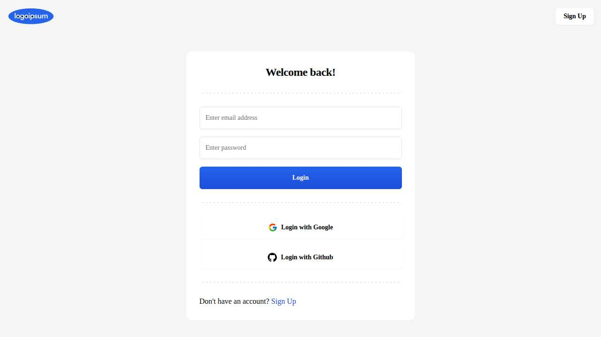

# Jira Clone

A modern, full-featured project management application inspired by Jira, built with the latest web technologies. This application provides comprehensive workspace management, team collaboration, and task tracking capabilities.

## 🚀 Features

- **Authentication System**
  - Email/password authentication
  - OAuth integration with Google and GitHub
  - Secure session management

- **Workspace Management**
  - Create and manage multiple workspaces
  - Workspace settings and customization
  - Team member invitations and management

- **Task & Project Management**
  - Task creation and assignment
  - Project organization and tracking
  - Dashboard with project overview

- **Team Collaboration**
  - Member management
  - Role-based access control
  - Real-time updates

- **Modern UI/UX**
  - Responsive design
  - Dark/light theme support
  - Intuitive interface with smooth animations

## 🛠️ Technology Stack

### Frontend
- **[Next.js 14](https://nextjs.org/)** - React framework with App Router
- **[TypeScript](https://www.typescriptlang.org/)** - Type-safe JavaScript
- **[Tailwind CSS](https://tailwindcss.com/)** - Utility-first CSS framework
- **[Radix UI](https://www.radix-ui.com/)** - Accessible component primitives
- **[Lucide React](https://lucide.dev/)** - Beautiful icons

### State Management & Forms
- **[TanStack Query](https://tanstack.com/query)** - Data fetching and caching
- **[React Hook Form](https://react-hook-form.com/)** - Form handling
- **[Zod](https://zod.dev/)** - Schema validation

### Backend & Database
- **[Hono](https://hono.dev/)** - Fast web framework for API routes
- **[Appwrite](https://appwrite.io/)** - Backend-as-a-Service platform
- **[Node Appwrite](https://github.com/appwrite/sdk-for-node)** - Server-side SDK

### Additional Libraries
- **[date-fns](https://date-fns.org/)** - Date manipulation
- **[React Day Picker](https://react-day-picker.js.org/)** - Date picker component
- **[Sonner](https://sonner.emilkowal.ski/)** - Toast notifications
- **[Next Themes](https://github.com/pacocoursey/next-themes)** - Theme management

## 📸 Screenshots

### Authentication

*Clean and modern sign-in interface with OAuth options*


*User registration with Google and GitHub integration*

### Dashboard

*Project monitoring dashboard with workspace navigation*

## 🚀 Getting Started

### Prerequisites

- Node.js 18+ installed
- npm, yarn, pnpm, or bun package manager
- Appwrite instance (local or cloud)

### Installation

1. **Clone the repository**
   ```bash
   git clone https://github.com/mnaimfaizy/jira-clone.git
   cd jira-clone
   ```

2. **Install dependencies**
   ```bash
   npm install
   # or
   yarn install
   # or
   pnpm install
   # or
   bun install
   ```

3. **Set up environment variables**
   ```bash
   cp .env.example .env.local
   ```
   
   Configure your environment variables:
   ```env
   # Appwrite Configuration
   NEXT_PUBLIC_APPWRITE_ENDPOINT=your_appwrite_endpoint
   NEXT_PUBLIC_APPWRITE_PROJECT=your_project_id
   APPWRITE_KEY=your_api_key
   
   # OAuth Configuration (optional)
   GOOGLE_CLIENT_ID=your_google_client_id
   GOOGLE_CLIENT_SECRET=your_google_client_secret
   GITHUB_CLIENT_ID=your_github_client_id
   GITHUB_CLIENT_SECRET=your_github_client_secret
   ```

4. **Run the development server**
   ```bash
   npm run dev
   # or
   yarn dev
   # or
   pnpm dev
   # or
   bun dev
   ```

5. **Open your browser**
   
   Navigate to [http://localhost:3001](http://localhost:3001) to see the application.
   
   > **Note:** The development server runs on port 3001 by default as configured in package.json

### Build for Production

```bash
npm run build
npm run start
```

## 📁 Project Structure

```
src/
├── app/                    # Next.js App Router
│   ├── (auth)/            # Authentication routes
│   ├── (dashboard)/       # Dashboard routes
│   └── (standalone)/      # Standalone pages
├── components/            # Reusable UI components
├── features/              # Feature-based modules
│   ├── auth/             # Authentication logic
│   ├── workspaces/       # Workspace management
│   └── members/          # Member management
├── hooks/                # Custom React hooks
├── lib/                  # Utility functions
└── config.ts            # Configuration files
```

## 🤝 Contributing

1. Fork the repository
2. Create your feature branch (`git checkout -b feature/amazing-feature`)
3. Commit your changes (`git commit -m 'Add some amazing feature'`)
4. Push to the branch (`git push origin feature/amazing-feature`)
5. Open a Pull Request

## 📝 License

This project is licensed under the MIT License - see the [LICENSE](LICENSE) file for details.

## 🙏 Acknowledgments

- Inspired by [Atlassian Jira](https://www.atlassian.com/software/jira)
- Built with modern React and Next.js best practices
- UI components based on [Radix UI](https://www.radix-ui.com/) primitives
